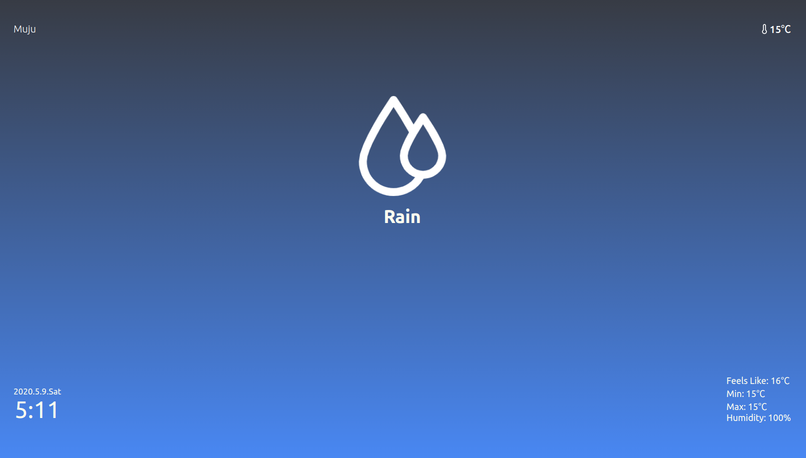

# Weather-app

Simple weather app.

Developing a cross-platform app using Expo.
\*not web app.

## Preview

## Features

-   Based on your location
-   Current weather information
-   Current temperature information
-   You can check today min-temp, max-temp, humidity and windchill

## Reference

-   openweathermap API
-   axios API
-   Expo framework
